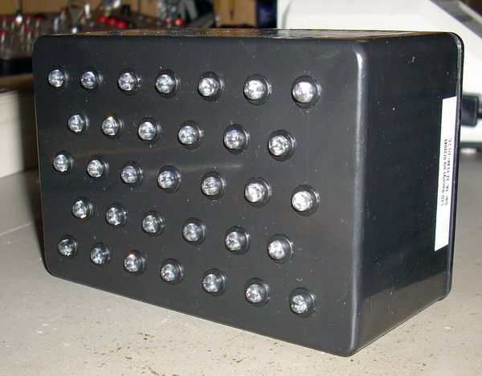

## Source code for project: [Emergency strobe light](https://link.stdout.no/8)

33 high intensity LEDs are controlled with a AVR ATtiny2313 microcontroller. Four flashing patterns that can be set manually or cycle through.

Written in basic, using [Bascom-AVR](http://www.mcselec.com/).

### Author
[Thomas Jensen](https://thomas.stdout.no)
